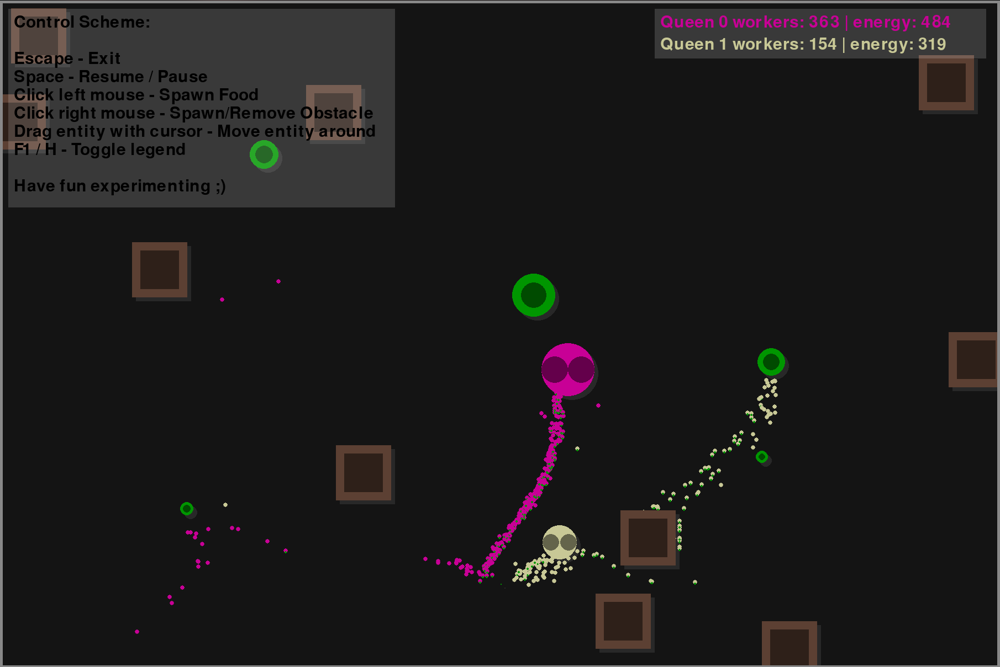

# Swarm-Intelligence-Simulation

## Project Description
The project represents a configurable swarm colony simulation. You can provide several parameters in the configuration files and start the app.

The swarm intelligence system consists of several queens, each with a number of workers belonging to her. The workers have a fixed lifetime and the queen slowly starves. However, the workers are supposed to provide the queen with two different resources which feed the queen. After the queens energy (as depicted in her size) exceeds a certain threshold, it produces new workers by depleting her own energy until the threshold is reached again. Multiple colonies of this configuration can exist. Food sources are shared between colonies and move around. They deplete after a short time when they are consumed by the workers. However, the total number of food sources at any moment is lower than a given threshold the there is a high chance that a new food source randomly spawns in the scene.

Additionally, the simulation contains obstacles no entity is able to pass through. Food and queens are just bouncing off, while workers must find a way around them, if they are able to.

On the right side of the screen you can see in numbers of the workers how the individualy colonies develop.

Disclaimer: The project idea and the algorithm for the swarm simulation is inspired by the project ["Screaming Insects" by Simulife Hub](https://www.youtube.com/watch?v=Yu7sF9rcVJY&ab_channel=SimulifeHub).

## Screenshot

## Worker Types
The workers come in different configurable types:
  - <b>Simple all-knowing workers</b> know everything that is happening and every position of every queen and food source in the scene at any time and always target the closest resource to bring back to the queen. Represents perfectly efficient swarming behavior.
  - <b>Advanced workers</b> do only know something when they touch it. They all constantly shout to indicate hints for their estimated distances to the last visited POIs to other workers of their own colony.

## Default Configurations
The default configuration provides a starting point to play around with the software. There is one yellow colony with simple workers and one purple colony with advanced workers. The yellow colony is parametrized to a slight disadvantage to not totally dominate the scene. However, one can observe the interesting paths the purple colony is forming from time to time while clustering into workforces at other times. Both queens are configured to never actively exceed an energy level of 1000.

## User Input
The user is able to interact with the simulation in four different ways:
  - Pressing escape stops the simulation and returns to the main menu.
  - Pressing space pauses the simulation
  - Left clicking on a free space places an additional random food source at this location
  - Right clicking on a free space places an additional obstacle at this location
  - Right clicking on an obstacle removes this obstacle
  - Dragging a queen, obstacle or a food source translates the entity to a new position by following the mouse cursor
  - F1 or H toggles the control scheme legend

## Experimental Findings
### Interesting Properties of Advanced Workers
- They are able to express simple path finding around obstacles with their behavioral rules.
- They tend to form clusters when their speed range is set higher than 0. The higher the range (the more variance is in the workers speed), the more extreme clusters form.
- After a small period of random movement due to overfeeding of their queen (max_energy parameter for queen), they also tend to form clusters.
- Their pathfinding behavior becomes more and more refined, the more workers are in the scene, and the further they are able to shout.
  - 300 workers with 100 units shouting range seems to be the point where they are generally able to organize themselves well.
- The pathfinding of the workers only acts as an approximation and is not guaranteed to be the optimum. If a path was established once between a queen and a food source it is hardly ever changing until the general situation changes. It also does not really converge to an optimal solution. Best observable when setting "the mean_food_energy" parameter in the scene_config.json to a high number (e.g. 800)

## Issues
- When using advanced workers a scanline optimized algorithm accelerates the shouting of the simulation. The benefits of the optimization are reduced however, when many workers are clustered on small portion of the scene, leading to reduced framerates. However, those framerate drops do not influence the validity of the simulation.

## Configs Documentation
If you have issues with the configs or if they are faulty, you can generate the default configs in the main menu of the program with the buttons on the lower right. The config file are located in the /config directory of the project.

### Scene Config
- background_color &rarr; The background color of the scene (RGB).
- screen_width &rarr; Screen width in pixels.
- screen_height &rarr; Screen height in pixels.
- min_food_available &rarr; Lower threshold how much food must be at least available before spawning in new food.
- mean_food_energy &rarr; Average energy a new food source is spawned in with.
- mean_food_speed &rarr; The average floating speed of a food source.
- food_type_ratio &rarr; The ratio of food types. Must add up to 1. Can at maximum be 3 different food types. Only changes the color of the spawned food for a visual effect.

### Queen Config
You can add as many queens in the queens list here. Each needs the following properties.
- birth_energy_threshold &rarr; Indicates how much energy the queen at least needs to start birthing new workers.
- energy &rarr; The starting energy of the queen.
- max_energy &rarr; The maximum energy the queen is allowed to have. If reached, the workers will behave randomly until energy is below again.
- energy_reduction_rate &rarr; How much energy the queen loses per tick.
- worker_spawn_cost &rarr; The energy cost to birth a new worker.
- speed &rarr; The speed of the queen when floating around.
- color &rarr; The primary color of the queen (RGB).
- start_worker_number &rarr; The number of workers the queens colony starts with.
- worker_type &rarr; The description of the worker colony associated with this queen.
  - worker_type/behavior &rarr; Either "SimpleWorker" or "AdvancedWorker". Indicates the above described behavioral types.
  - worker_type/mean_energy &rarr; The average energy each worker is born with.
  - worker_type/energy_range &rarr; The range in which the energy around the mean_energy is distributed.
  - worker_type/mean_speed &rarr; The average movement speed each worker is born with.
  - worker_type/speed_range &rarr; The range in which the movement speed around the mean_energy is distributed.
  - worker_type/shouting_radius &rarr; (Only for "AdvancedWorker") The radius each worker is able to signal its distance information to other workers.
